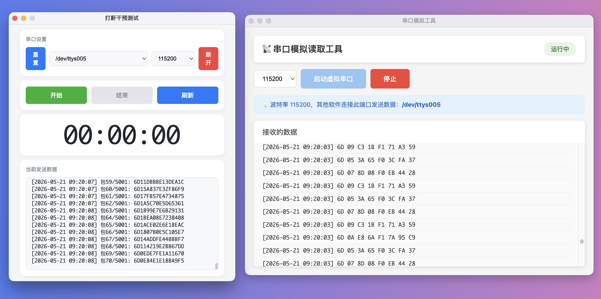

# 串口工具集

基于 Electron 的串口数据读写工具，包含两个独立应用：串口读取工具和串口写入工具。

## 功能预览



## 项目结构

```
├── com-read/     # 串口数据读取工具
└── com-write/    # 串口写入工具
```

## 功能特性

### com-read - 串口读取工具
- 实时读取串口数据
- 支持多平台（Windows / macOS）
- 自动更新功能

### com-write - 串口写入工具
- 向串口发送数据
- 支持多平台（Windows / macOS）

## 开发环境

- Node.js
- Electron

## 安装依赖

进入对应目录，运行：

```bash
cd com-read   # 或 cd com-write
npm install
```

## 运行应用

```bash
npm start
```

## 打包构建

```bash
npm run build    # com-read
npm run dist     # com-write
```

## 许可证

MIT
